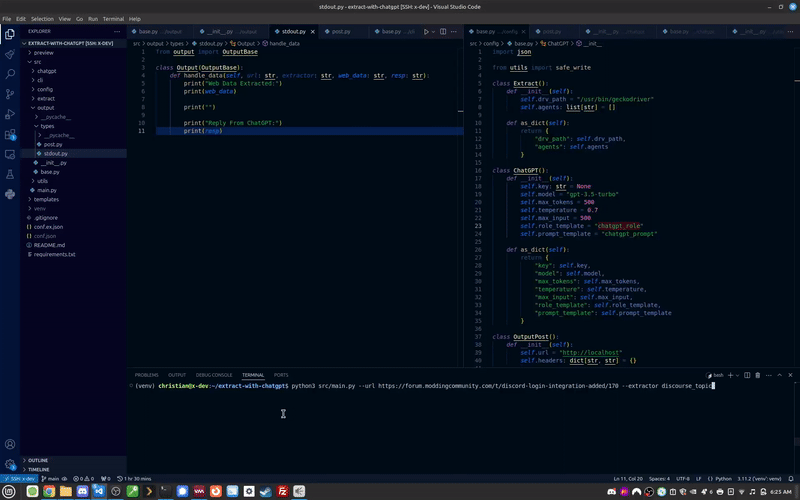

A [Python](https://www.python.org/) project that extracts data from websites using [Selenium](https://www.selenium.dev/) and [BeautifulSoup4](https://pypi.org/project/beautifulsoup4/), then either prints the results to `stdout` or sends them via a POST request. Optionally, the extracted web data can be processed through [OpenAI](https://openai.com/)'s **[ChatGPT](https://openai.com/index/chatgpt/) API**, with the API response included in the final output!

This project was intended for Linux, but may work on Windows after adjustments.



Before making this project, I created a private project for my modding [community](https://moddingcommunity.com) that utilized the above technologies which inspired me to make this open source project. I'm hoping the code in this repository helps other developers who want to integrate ChatGPT into their projects or wants to see how to parse and extract data from websites.

## Extractors
The URL specified is parsed through *extractors* which are classes intended to extract specific data from the web page. As of right now, there are two extractors; `default` and `discourse_topic`.

The [`default`](./src/extract/extractors/default.py) extractor returns all *text* from within the `<body>` tag when the web page is loaded. Keep in mind that this does not wait for data generated by JavaScript to load and only returns what the web server initially renders normally (I'll most likely implement better support for waiting for specific content to load later).

The last extractor is [`discourse_topic`](./src/extract/extractors/discourse_topic.py) which specifically extracts the *text* contents of a topic from a [Discourse](https://discourse.org) forum. I made this extractor because I used my modding [forum](https://forum.moddingcommunity.com) to test this project.

Additional extractors may be created for those interested! Feel free to take a look at the source code from [`src/extract`](./src/extract/). You may also be interested in [this](https://github.com/gamemann/How-To-Use-Selenium-And-BeautifulSoup) lab/guide I made on how to extract data from web pages using Selenium and BeautifulSoup4 which includes examples that utilizes JavaScript and waits for specific content to load.

## Requirements
* An OpenAI key which may be retrieved after setting up billing from [here](https://platform.openai.com/signup).
* The URL to a web page that supports extracting data from one of the extractors [here](./src/extract/extractors).

### Firefox Geckodriver
In order for Selenium to operate, you need the Firefox Geckodriver which may be found [here](https://github.com/mozilla/geckodriver/releases) along with the `firefox-esr` package.

```bash
# Download Geckodriver 0.35.0 driver.
wget https://github.com/mozilla/geckodriver/releases/download/v0.35.0/geckodriver-v0.35.0-linux64.tar.gz

# Extract Geckodriver binary.
tar -xzvf geckodriver-v0.35.0-linux64.tar.gz

# Move binary to /usr/bin.
sudo mv geckodriver /usr/bin

# Install the Firefox ESR package using apt (for Debian/Ubuntu-based systems).
sudo apt install -y firefox-esr
```

### Python
Python (version 3 or higher) is required to run this project. Additionally, the following Python packages are required.

* Selenium (`4.27.1`)
* Beautifulsoup4 (`4.12.3`)
* Requests (`2.32.3`)
* Jinja2 (`3.1.5`)
* OpenAI (`1.57.4`)

You may install these packages using the following command after cloning this repository.

```bash
pip3 install -r requirements.txt
```

#### Python Virtual Environment
I recommend running this project within a virtual environment in Python. You can create a virtual environment using the following command assuming you have the required Python packages on your server.

```bash
python3 -m venv venv/
```

You can then activate the virtual environment and install the required packages listed above inside of the environment.

```bash
# Activate virtual environment.
source venv/bin/activate

# Download required packages in new environment.
pip3 install -r requirements.txt
```

## Command Line Usage & Running
The following command line arguments are supported when running this application.

| Name | Default | Description |
| ---- | ------- | ----------- |
| -c, --cfg | `./conf.json` | Path to config file. |
| -u, --url | `None` | The URL to parse. If not specified, you will need to input after starting the program. |
| -e, --extractor | `None` | The extractor to use. If not specified, you will need to input after starting the program. |
| -s --silent | N/A | When set, verbose output will be disabled. |
| -l, --list | N/A | Lists contents of the config settings and exits. |
| -h, --help | N/A | Prints the help menu and exits. |

<details>
    <summary>Example(s)</summary>

### Run & Load Custom Config
```bash
python3 src/main.py -c /etc/mycustomconf.json
```

### Run & List Config Settings
```bash
python3 src/main.py -l
```

### Run & Print Help Menu
```bash
python3 src/main.py --help
```

### Run & Load Forum Topic From My Modding Forum
```bash
python3 src/main.py -u https://forum.moddingcommunity.com/t/discord-login-integration-added/170 -e discourse_topic
```
</details>

## Configuration
The default configuration file is located at `./conf.json`, but can be changed with the command line arguments mentioned above. I recommend copying the [`conf.ex.json`](./conf.ex.json) file to `conf.json` for new users.

Here is a list of configuration settings.

| Name | Type | Default | Description |
| ---- | ---- | ------- | ----------- |
| save_to_fs | bool | `false` | Saves config to file system after parsing. This is good for automatic formatting and saving all available settings to config file. |
| templates_dir | string | `templates` | The path to the [`templates/`](./templates/) directory without the last forward slash. |
| extract | Extract Object | `{}` | The extract object (read below). |
| chatgpt | ChatGPT Object | `{}` | The ChatGPT object (read below). |
| output | Output Object | `{}` | The output object (read below). |

<details>
    <summary>Example(s)</summary>

### Save To Filesystem
```json
{
    "save_to_fs": true,
    "extract": {},
    "chatgpt": {},
    "output": {}
}
```
</details>

### Extract Object
The extract object contains settings related to extracting the web data.

| Name | Type | Default | Description |
| ---- | ---- | ------- | ----------- |
| drv_path | string | `/usr/bin/geckodriver` | The path to the Geckodriver binary file. |
| agents | string array | `[]` | A list of user agents to randomly select from when sending web request. |

<details>
    <summary>Example(s)</summary>

#### Use Custom User Agents
```json
{
    "agents":
    [
        "Mozilla/5.0 (X11; Ubuntu; Linux x86_64; rv:121.0) Gecko/20100101 Firefox/121.0"
    ]
}
```
</details>

### ChatGPT Object
The ChatGPT object contains settings related to OpenAI and ChatGPT.

| Name | Type | Default | Description |
| ---- | ---- | ------- | ----------- |
| enabled | bool | `true` | When enabled, send extracted web data through the ChatGPT API and includes API response in final output. |
| key | string | `null` | The OpenAI key (required). |
| model | string | `gpt-3.5-turbo` | The ChatGPT model to use. |
| max_tokens | int | `500` | The maximum tokens to use with the request. |
| temperature | float | `0.7` | The temperature to use with the ChatGPT request. Read more about this [here](https://aimresearch.co/leaders-opinion/leaders-opinion-how-temperature-affects-chatgpt-with-rachael-chudoba). |
| max_input | int | `500` | The maximum characters to send to the ChatGPT API (input). |
| role_template | string | `chatgpt_role` | The template file name to use with the system's role in ChatGPT from the [`templates/`](./templates/) directory without the file extension (`.tpl`). |
| prompt_template | string | `chatgpt_prompt` | The template file name to use with the user's prompt in ChatGPT from the [`templates/`](./templates/) directory without the file extension (`.tpl`). |

Here is a list of model code names you can use with the `model` setting.

* *gpt-3.5-turbo*
* *gpt-3.5-turbo-16k*
* *gpt-4*
* *gpt-4-32k*
* *gpt-4o*
* *gpt-4o-mini*
* *o1-mini*
* *o1*
* *o1-pro*

**NOTE** - There are multiple models you may use including GPT-4o and GPT-4o-mini. However, I've found the newer models are **very** expensive with the API compared to GPT-3. Therefore, I recommend using the GPT-3 model when you can. For a list of models, check [here](https://platform.openai.com/docs/models/gp)! For information on pricing, check [here](https://openai.com/api/pricing/)!

<details>
    <summary>Example(s)</summary>

#### Use GPT-4o (EXPENSIVE!)
```json
{
    "key": "CHANGEME",
    "model": "gpt-4o",
    "max_tokens": 500,
    "temperature": 0.5,
    "max_input": 1000
}
```
</details>

## Output Object
The output object is used for sending the ChatGPT response somewhere.

| Name | Type | Default | Description |
| ---- | ---- | ------- | ----------- |
| type | string | `stdout` | The type of output to use (`stdout` or `post` are supported right now). |
| stdout | Stdout Object | `{}` | Settings for the Stdout type. |
| post | POST Object | `{}` | Settings for the POST type. |

When a POST request is sent, the content type is `application/json` and an example of the request body may be found below.

```json
{
    "url": "<URL Parsed>",
    "extractor": "<Extractor Used>",
    "web_data": "<Web Data Extracted>",
    "chatgpt_res": "<ChatGPT Response>"
}
```

### Stdout Object
The Stdout object contains settings when using the `stdout` type to output the results to the `stdout` pipe.

| Name | Type | Default | Description |
| ---- | ---- | ------- | ----------- |
| use_json | bool | `false` | Outputs results in JSON format. |
| file_path | string | `null` | If set, will write the results to a file at this path. |
| file_append | bool | `false` | If true, will append the results to the file. |

<details>
    <summary>Example(s)</summary>

#### Output With JSON & Append Results To File
```json
{
    "use_json": true,
    "file_path": "./ewc.json",
    "file_append": true
}
```
</details>

### POST Object
The POST object contains settings when using the `post` type to send results to a web endpoint via a POST request.

| Name | Type | Default | Description |
| ---- | ---- | ------- | ----------- |
| url | string | `http://localhost` | The URL to send the POST request to. |
| headers | Object <string, string> | `{}` | Any headers to send with the request. |

<details>
    <summary>Example(s)</summary>

#### Send POST Request With Auth Token
```json
{
    "type": "post",
    "post":
    {
        "url": "https://api.mydomain.com/web-extract",
        "headers":
        {
            "Authorization": "Bearer <MY TOKEN>"
        }
    }
}
```
</details>

## Notes
### Template System For ChatGPT Role & Prompt
A basic template system is used when formatting what role and prompt to send ChatGPT. Templates may be found in the [`templates/`](./templates/) directory.

The variables `url` and `content` are passed to the templates, so feel free to use them (e.g. `{{ content }}`).

## Credits
* [Christian Deacon](https://github.com/gamemann)